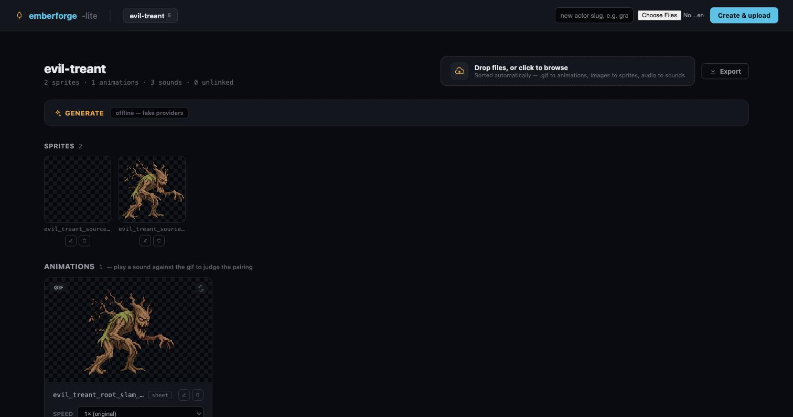

# Emberforge Lite

A small, dependency-free, local-first workbench for reviewing pixel-art game
characters. For each **actor** you see its sprites and animations, hear each
sound *against* the animation it belongs to, and — when you choose to — generate
new assets through provider APIs, without leaving the page.



One folder per actor on disk, one static page per actor, and a standard-library
Python server that reads and writes that folder. No database, no framework, no
runtime dependencies. Python 3.9–3.13, macOS and Linux.

## Why

My sprites, animations, and sounds ended up scattered — across folders,
provider dashboards, and one-off exports — with no single place to see an actor
whole. I wanted one location where I could open an actor and view everything
that belongs to it: its sprites, its animations, and each sound played *against*
the animation it goes with. Emberforge Lite is that place.

## Install

```bash
pipx install git+https://github.com/bghannum/emberforge-lite.git@v0.1.0
```

## Try it — offline, no keys

```bash
emberforge-lite demo
```

This serves the **evil-treant** sample actor on `http://127.0.0.1:8000/` with no
network and no credentials — real sprites, animation, and sounds generated on the
author's own paid provider subscriptions (see
[the sample's provenance notes](src/emberforge_lite/demo_assets/README.md)). Open
the URL and explore: watch the animation at different speeds, play a linked sound
against it, and open the **Generate** panel (it answers with offline fakes).

## Use it on your own actors

```bash
emberforge-lite serve                       # offline: deterministic fake providers
emberforge-lite serve --allow-spend \
    --env-file /path/to/your.env            # real SpriteLab / OpenAI / ElevenLabs
```

Runtime data lives in one directory (override with `--data-dir` or
`EMBERFORGE_DATA_DIR`; the default is per-user — `~/Library/Application Support/
emberforge-lite` on macOS, `$XDG_DATA_HOME/emberforge-lite` on Linux):

```
<data-dir>/actors/<slug>/{sprites,animations,sounds,sheets,links.json,generations.jsonl,provenance.json}
<data-dir>/site/{gallery.html,actor-<slug>.html}
<data-dir>/{tmp,logs}
```

Already have an actor tree from an earlier version? Copy it in without touching
the source: `emberforge-lite migrate /old/path --data-dir <data-dir>`.

## What's on an actor page

Upload (files are sorted by extension, names sanitized, collisions suffixed);
sprites; animations with a **speed dial** that rewrites GIF delays on the fly
(the file on disk is untouched), a **▶ Play with sound** pill per linked sound in
lockstep with the audio, **✂ trim** and **× unlink**, a **link a sound** picker,
and a **sheet** download; rename/delete on every asset (kept in step with
`links.json`, sibling spritesheets, and provenance); **export** to a zip; and a
**Generate** panel. Each asset carries a badge — **generated**, **uploaded**, or
**rights unknown** — so borrowed art is never mistaken for your own. Every change
rebuilds the pages from disk, so what you see is what is on disk.

## Generate — safety model

Nothing is spent without two deliberate steps:

1. The server must be started with `--allow-spend`; otherwise deterministic
   fakes answer and the badge says **offline**.
2. Every call is **Estimate → Confirm**: Estimate shows the exact amount and the
   filename that will be written; Confirm echoes that amount back, and the server
   refuses if the estimate changed underneath it.

| Tab | Provider | Cost snapshot* |
|---|---|---|
| Animate a sprite | SpriteLab `/animate` | 20 credits |
| Sound | ElevenLabs sound effects | 40 credits/s requested (800 ms → 32) |
| Source sprite | SpriteLab `/generate` · OpenAI `gpt-image-2` | 1 credit (epic) / 6 (mythic) · $0.006 |

\* Dated snapshots (reviewed 2026-08-21/22), not live quotes. Pricing and terms
are the provider's to define and change — read each provider's own current terms,
they are authoritative; see [docs/providers.md](docs/providers.md) for what was
reviewed and the links. Credentials are read only from the environment or the
`--env-file` you name; they are never auto-discovered, never logged, and never
reach the browser. See [`.env.example`](.env.example).

The server binds to loopback only, rejects non-loopback `Host` headers, requires
a same-origin request with a CSRF token on every mutation, sends a strict
Content-Security-Policy, validates uploads before committing them, and serves
only generated pages and actor media — never credentials, source, or the ledger.
Full model: [docs/threat-model.md](docs/threat-model.md).

## Architecture

```
emberforge-lite serve
   ├── web layer     server.py, build.py, static/app.{css,js}   (strict CSP, no inline JS)
   ├── generation    generate.py, providers/ (spritelab, openai_images, elevenlabs, fakes)
   └── storage       storage.py (per-actor locks + atomic writes), provenance.py, logs.py
                          ▼
                     <data-dir>/{actors,site,tmp,logs}
```

Details in [docs/architecture.md](docs/architecture.md);
data and metadata layout in [docs/provenance-format.md](docs/provenance-format.md).

## Development

```bash
git clone https://github.com/bghannum/emberforge-lite.git && cd emberforge-lite
python3 -m venv .venv && source .venv/bin/activate
pip install -e ".[dev]"
ruff check . && pytest
```

The installed runtime is standard-library only; tests run with no network and no
credentials. See [CONTRIBUTING.md](CONTRIBUTING.md).

## Scope

Emberforge Lite is a **single-user, local-first** personal workbench — no
accounts, no authorization, no multi-user story, not a hosted service. The root
`server.py`, `build.py`, and `link.py` are deprecated launchers that forward to
the CLI and will be removed in `v0.2.0`.

The code is licensed under the [MIT License](LICENSE). The bundled demo assets
are generated provider output distributed under the providers' terms with
copyright status as provided — see [`NOTICE`](NOTICE).
